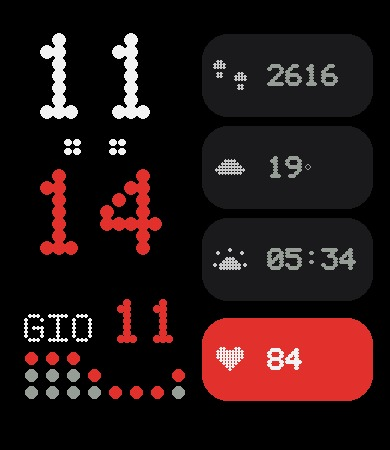

# Dot Vertical — Amazfit Bip 6 watch face

A dot-matrix, vertical watch face for the **Amazfit Bip 6** (Zepp OS, 390×450).
Hours over minutes with a blinking two-dot separator, date, four stacked
metric pills (steps · weather · sunrise · heart rate) and a **pixel equalizer
driven by your heart rate**.



## Features

- **Time**: HH (white) over MM (red), big dot-matrix digits, blinking `:` separator (~1 Hz)
- **Date**: weekday in the system language (21 Latin sets, EN fallback) + day of month
- **Pills** (tappable → open the native app):
  - 👟 steps · 🌥️ weather (dynamic icon + current temp) · 🌅 sunrise · ❤️ heart rate
- **12 curated weather icons** mapped from the 29 official Huami condition codes
- **Heart-rate equalizer**: 8 pixel bars whose amplitude and speed follow your current BPM
- Comes alive when the screen is on (animation pauses in AOD to save battery)

## Build

```bash
npm install
npx zeus build      # outputs dist/<appId>-Dot_Vertical-<ver>.zab
```

Preview on a paired device (from a machine that can open a browser for `zeus login`):

```bash
npx @zeppos/zeus-cli preview
```

## Tooling

The pixel assets are generated from Python (PIL) — no proprietary fonts:

- `tools/dotfont.py` — dot-matrix glyph/bitmap renderer
- `tools/weather12.py` — the 12 weather icons + the 0..28 Huami mapping
- `tools/gen_assets.py` — generates every PNG into `assets/bip-6/`
- `tools/mockup_v_anim.py` — animated GIF mockup of the full face

## Credits & references

Built on the Zepp OS `config-version-v3` watchface scaffold. Weather codes,
native screen names and language indices were reverse-engineered and collected
in the companion guide:
<https://github.com/masimoneext-sketch/amazfit-bip6-watchface-guide>

## License

MIT — see [LICENSE](LICENSE).
